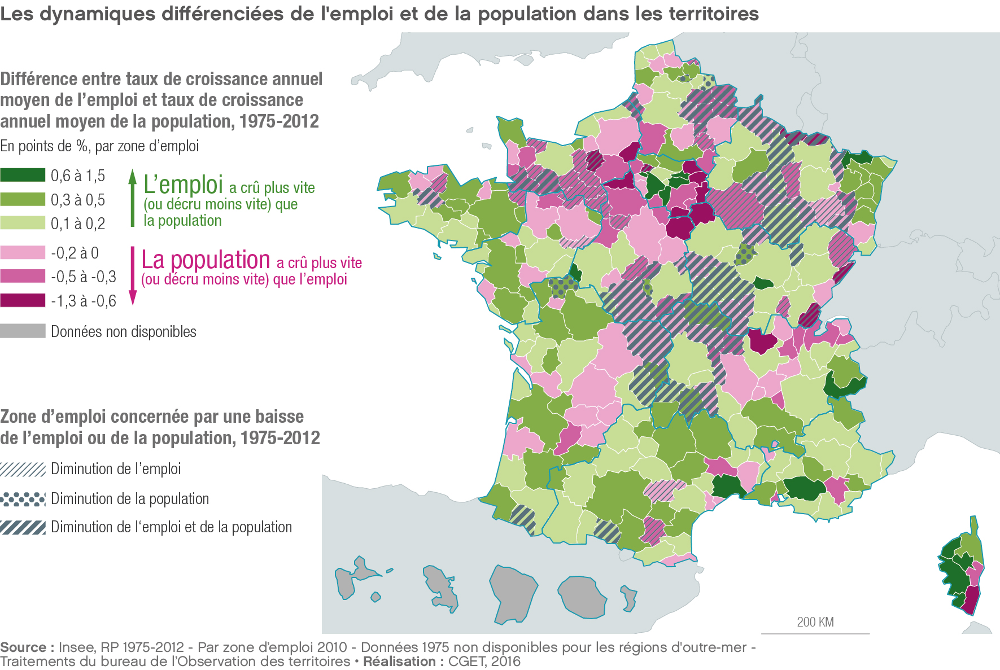
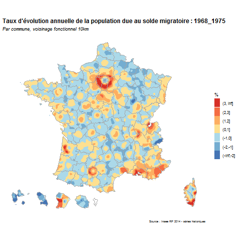

# Déterminants individuels et tendances de la mobilité résidentielle

Le rapport des individus à l’espace et leur propension à changer de territoire varient selon les étapes du cycle de vie, selon certaines caractéristiques individuelles, mais aussi selon des facteurs extérieurs tels que la conjoncture économique et le type de territoire de résidence. La première partie de ce rapport expose les grandes lignes des facteurs explicatifs individuels de la mobilité résidentielle de plus ou moins longue distance, et met ce phénomène en perspective avec les tendances des dernières décennies et avec les niveaux de mobilité observés dans les autres pays européens. Les différences de mobilité selon les types de territoire font quant à elles l’objet de la seconde partie du rapport.


## Une majorité de mobilités résidentielles de proximité

bla 

## De fortes différences de mobilité selon le profil des individus

bla bla
un exemple d'intégration de visuel charté CGET :

{ width=80% }

ou de gif joué depuis R

```{r, out.width = "700px",echo=F, message=F, warning=F}
if (knitr:::is_latex_output()) {
  knitr::asis_output('\\url{....}')
} else {
  
}

```

ou des iframes

<iframe src='http://carto.observatoire-des-territoires.gouv.fr/#s=2010-2015;v=map56;i=insee_rp_evol_1968.var_pop;l=fr' ></iframe>

Des citations à retrouver dans la biblio **bookdown** package [@R-bookdown] in this sample book, which was built on top of R Markdown and **knitr** [@xie2015].